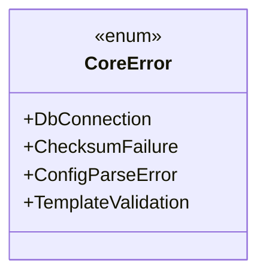
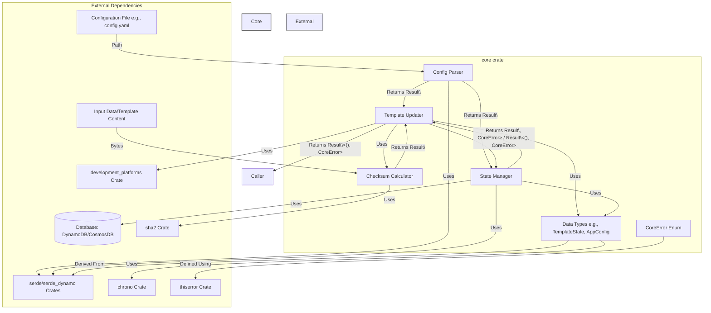
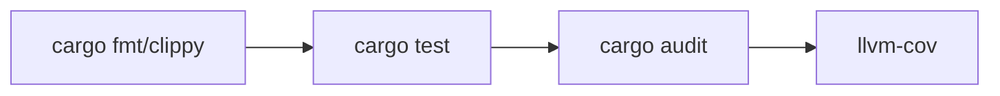

# Core Library Design

## Problem Description

The Template Teleporter requires a core library to handle shared logic for checksum calculation,
configuration parsing, and state management. This library will centralize these functionalities,
ensuring consistency and reusability across the application.

## Surrounding Context

The core library will be used by other modules, such as the GitHub integration and CLI modules.
It must be efficient, reliable, and easy to integrate. The library will leverage the `serde`, `sha2`,
and `serde_dynamo` crates for its implementation.

## Proposed Solution

### Design Goals

This library will contain the Core logic, data structures, state management and database interactions
for the Template Teleporter application.

- Centralize shared logic to improve maintainability.
- Ensure high performance and reliability.
- Provide a clear and well-documented API.

### Responsibilities

- Define shared data models (e.g., `TemplateState`).
- Implement checksum calculation logic.
- Provide utilities for configuration parsing.
- Interact with DynamoDB or Cosmos DB for storing and retrieving `TemplateState`.
- Implement retry logic for database operations.

### Design Constraints

- Must use the `serde`, `sha2`, and `serde_dynamo` crates.
- Must be compatible with the existing architecture and workflows.

### Design Decisions

- Use the `sha2` crate for checksum calculation.
- Use the `serde` crate for configuration parsing.
- Use the `serde_dynamo` crate for state management.

### Alternatives Considered

- Implementing custom logic for checksum calculation and state management. This was rejected due to
  increased complexity and maintenance overhead.

- Using a different serialization format instead of `serde`. This was rejected due to the need for
  compatibility with existing systems.

### Error Strategy

Uses `thiserror` for explicit error handling:



## Design

### Architecture

The core library will be implemented as a Rust module named `core`.



It will include the following logical components:

- **Data Types**: Structs and Enums defining the core data models (`TemplateState`, `AppConfig`) and errors (`CoreError`).
- **Configuration Parsing**: Logic to load and validate configuration (`parse_config` function).
- **Checksum Calculation**: Utility function (`calculate_checksum`) using SHA-256.
- **State Management**: A `StateManager` struct handling interactions with the database (DynamoDB/CosmosDB) via `serde_dynamo` or SDKs (`get_state`, `update_state`).
- **Template Updating**: A `TemplateUpdater` struct orchestrating the update process, using the state manager, checksum calculator, and traits from the `development_platforms` crate (`process_update`).

### Proposed Types and Functions

Below are suggested structures and signatures. Actual implementation may vary.

```rust
use std::path::Path;
use chrono::{DateTime, Utc};
use serde::{Deserialize, Serialize};
use thiserror::Error;
// Assuming development_platforms defines necessary traits
// use development_platforms::PlatformUpdater;

/// Custom error types for the core library.
#[derive(Error, Debug)]
pub enum CoreError {
    #[error("Database connection or operation error: {0}")]
    DatabaseError(String), // Consider specific DB errors if needed
    #[error("Checksum calculation failed: {0}")]
    ChecksumFailure(String),
    #[error("Configuration parsing error: {source}")]
    ConfigParseError { #[from] source: serde_yaml::Error }, // Example for YAML
    #[error("Template validation failed: {0}")]
    TemplateValidation(String),
    #[error("I/O error: {0}")]
    IoError(#[from] std::io::Error),
    #[error("Missing configuration value: {0}")]
    MissingConfiguration(String),
    #[error("Platform interaction error: {0}")]
    PlatformError(String), // For errors from development_platforms
    // Add other specific errors as needed
}

// Define a standard Result type for the crate.
pub type Result<T> = std::result::Result<T, CoreError>;

/// Represents the state of a managed template.
#[derive(Serialize, Deserialize, Debug, Clone, PartialEq)]
pub struct TemplateState {
    #[serde(rename = "templateId")] // Example: Match DynamoDB attribute names
    pub template_id: String,
    #[serde(rename = "sourceRepository")]
    pub source_repository: String,
    #[serde(rename = "currentChecksum")]
    pub current_checksum: String,
    #[serde(rename = "lastUpdatedUtc")]
    pub last_updated_utc: DateTime<Utc>,
    // Add other relevant state fields, e.g., version, deployment status
}

/// Represents the application's configuration.
#[derive(Serialize, Deserialize, Debug, Clone, PartialEq)]
#[serde(rename_all = "camelCase")] // Example: Consistent config naming
pub struct AppConfig {
    pub database_type: DatabaseType,
    pub database_endpoint: Option<String>,
    pub table_name: String,
    // Add other configuration settings, e.g., retry policy, platform credentials
}

#[derive(Serialize, Deserialize, Debug, Clone, PartialEq)]
#[serde(rename_all = "lowercase")]
pub enum DatabaseType {
    Dynamodb,
    Cosmosdb,
    // Add other potential DB types if needed (e.g., Filesystem for testing)
}


/// Calculates the SHA-256 checksum for the given input data.
///
/// # Arguments
/// * `data` - A byte slice representing the data to checksum.
///
/// # Returns
/// A `Result` containing the hex-encoded SHA-256 checksum string or a `CoreError`.
pub fn calculate_checksum(data: &[u8]) -> Result<String> {
    use sha2::{Digest, Sha256};
    let mut hasher = Sha256::new();
    hasher.update(data);
    let result = hasher.finalize();
    Ok(hex::encode(result)) // Requires hex crate
}

/// Parses the application configuration from a specified YAML file path.
///
/// # Arguments
/// * `config_path` - Path to the configuration file.
///
/// # Returns
/// A `Result` containing the parsed `AppConfig` or a `CoreError`.
pub fn parse_config(config_path: &Path) -> Result<AppConfig> {
    let file = std::fs::File::open(config_path)?;
    let config: AppConfig = serde_yaml::from_reader(file)?; // Assumes YAML format
    // Add validation logic here if needed
    Ok(config)
}

/// Manages state persistence.
#[derive(Debug)] // Avoid Clone unless necessary
pub struct StateManager {
    // Internal fields for DB client (e.g., rusoto_dynamodb::DynamoDbClient)
    // config: AppConfig, // Store necessary parts of config
    table_name: String,
    // db_client: Arc<dyn DbClientTrait>, // Example using a trait for testability
}

impl StateManager {
    /// Creates a new StateManager instance based on configuration.
    pub async fn new(config: &AppConfig) -> Result<Self> {
        // Initialize DB client based on config.database_type
        // Handle endpoint override
        unimplemented!("Initialize DB client based on config")
    }

    /// Retrieves the state for a given template ID. Returns Ok(None) if not found.
    pub async fn get_state(&self, template_id: &str) -> Result<Option<TemplateState>> {
        // Implementation using serde_dynamo or specific SDK
        // Handle potential errors and map to CoreError::DatabaseError
        unimplemented!("Fetch state for template_id: {}", template_id)
    }

    /// Saves or updates the state for a template.
    pub async fn update_state(&self, state: &TemplateState) -> Result<()> {
        // Implementation using serde_dynamo or specific SDK
        // Include retry logic here or configure it in the client
        // Handle potential errors and map to CoreError::DatabaseError
        unimplemented!("Update state for template_id: {}", state.template_id)
    }
}

/// Handles the template update workflow.
#[derive(Debug)]
pub struct TemplateUpdater {
    state_manager: StateManager,
    // config: AppConfig, // Store necessary parts
    // platform_clients: Vec<Box<dyn PlatformUpdater>>, // Inject platform clients
}

impl TemplateUpdater {
    /// Creates a new TemplateUpdater instance.
    pub async fn new(config: &AppConfig /*, other dependencies */) -> Result<Self> {
        let state_manager = StateManager::new(config).await?;
        // Initialize platform clients based on config
        unimplemented!("Initialize TemplateUpdater with dependencies")
    }

    /// Processes a template update notification, fetching the template data internally or receiving it.
    ///
    /// # Arguments
    /// * `template_id` - The unique ID of the template being updated.
    /// * `source_repository` - The source location to fetch the template from.
    /// * `new_template_data` - Optional: Pre-fetched template data. If None, it should be fetched.
    pub async fn process_update(
        &self,
        template_id: &str,
        source_repository: &str,
        new_template_data: &[u8], // Assuming data is passed in for now
    ) -> Result<()> {
        // 1. Calculate checksum of new_template_data
        let new_checksum = calculate_checksum(new_template_data)?;

        // 2. Get current state
        let current_state_opt = self.state_manager.get_state(template_id).await?;

        // 3. Compare checksums
        let needs_update = match &current_state_opt {
            Some(current_state) => current_state.current_checksum != new_checksum,
            None => true, // No previous state, definitely needs update/creation
        };

        if needs_update {
            // 4. Update relevant repositories using platform_clients (if applicable)
            //    This step might need more context or data
            //    Example: self.update_platforms(template_id, new_template_data).await?;

            // 5. Create/update TemplateState struct
            let new_state = TemplateState {
                template_id: template_id.to_string(),
                source_repository: source_repository.to_string(),
                current_checksum: new_checksum,
                last_updated_utc: Utc::now(),
            };

            // 6. Save new state
            self.state_manager.update_state(&new_state).await?;
            println!("State updated for template: {}", template_id); // Logging
        } else {
            println!("No state change detected for template: {}", template_id); // Logging
        }

        Ok(())
    }

    // Helper function for platform updates (example)
    // async fn update_platforms(&self, template_id: &str, data: &[u8]) -> Result<()> {
    //     for client in &self.platform_clients {
    //         client.update_repository(template_id, data).await.map_err(|e| CoreError::PlatformError(e.to_string()))?;
    //     }
    //     Ok(())
    // }
}
```

### Data Flow

1. A notification for a changed template is received.
2. The state is retrieved from DynamoDB or Cosmos DB.
3. The checksum is calculated for the new template using the `sha2` crate.
4. The state is updated with the new checksum and other relevant information.
5. The relevant repositories are updated using the `development_platforms` crate.
6. The updated state is saved back to DynamoDB or Cosmos DB.

### Other Relevant Details

- The library will include unit tests to ensure correctness.
- Documentation comments will be added for all public items.

## Verification

| Test Type       | Tools          | Coverage Target |
|-----------------|----------------|-----------------|
| Unit            | cargo test     | 95% branches    |
| Integration     | testcontainers | 100% workflows  |
| Mutation        | cargo mutants  | 85% survival    |

### CI/CD Pipeline Flow



## Conclusion

The core library will provide essential shared logic for the Template Teleporter application. By
centralizing these functionalities, the library will improve maintainability, consistency, and
performance.
