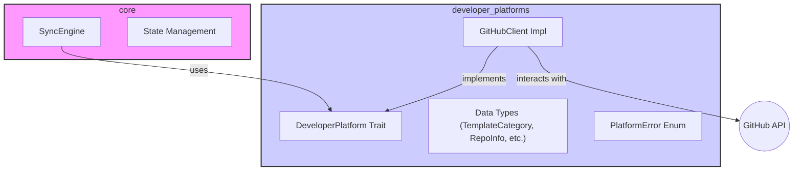

# Developer Platforms Crate Specification

## 1. Problem Description

The Template Teleporter system needs a way to interact with various developer platforms (initially
GitHub) to fetch template information, manage repositories and  create pull requests. This crate
provides the necessary abstractions and implementations for these interactions.

## 2. Surrounding Context

This crate is a core component of the Template Teleporter workspace. It defines the primary interface
(`DeveloperPlatform`) for interacting with external platforms. The `core` crate depends on this
interface to perform its synchronization logic in a platform-agnostic manner. Implementations, like
the `GitHubClient`, reside within this crate.

## 3. Proposed Solution

### 3.1 Design Goals

* Provide a clear, asynchronous trait (`DeveloperPlatform`) for platform interactions.
* Encapsulate platform-specific details (API clients, authentication) within implementations.
* Define shared data structures for templates, repositories, and changes.
* Establish a consistent error handling mechanism (`PlatformError`).
* Support GitHub as the initial platform.
* Be extensible for future platforms (e.g., GitLab, Bitbucket).

### 3.2 Design Constraints

* Must integrate seamlessly with the `template_teleporter_core` crate.
* Requires asynchronous operations (`async-trait`).
* Relies on configuration for platform credentials (e.g., GitHub App details).

## 4. Design

### 4.1 Architecture



### 4.2 Platform Integration Trait

```rust
use async_trait::async_trait;
use chrono::{DateTime, Utc};
use serde::{Deserialize, Serialize};
use std::path::PathBuf; // Assuming TemplatePath might become more complex

// Placeholder for potential path abstraction
pub type TemplatePath = String;

#[derive(Debug, Clone, PartialEq, Eq, Hash, Serialize, Deserialize)]
pub struct TemplateCategory(pub String);

#[derive(Debug, Clone)]
pub struct TemplateMetadata {
    pub path: TemplatePath,
    pub checksum: String, // SHA-256 checksum of the content
    pub last_updated: DateTime<Utc>, // From commit history
}

#[derive(Debug, Clone)]
pub struct RepoInfo {
    pub org: String,
    pub name: String,
    pub default_branch: String,
}

#[derive(Debug, Clone)]
pub struct TemplateChange {
    pub path: TemplatePath,
    pub old_checksum: Vec<String>, // Checksums before change, if known, store upto 10
    pub new_checksum: String, // Checksum after change
    pub content: Vec<u8>, // The new content
}

#[derive(Debug, Serialize)]
pub struct UpdateResult {
    pub pr_url: String,
    pub pr_number: u64,
    pub updated_files: Vec<TemplatePath>,
}

#[derive(thiserror::Error, Debug)]
pub enum PlatformError {
    #[error("Authentication failed: {0}")]
    AuthError(String),
    #[error("API rate limit exceeded")]
    RateLimitExceeded,
    #[error("Repository not found: {org}/{name}")]
    RepoNotFound { org: String, name: String },
    #[error("Template path not found: {0}")]
    TemplateNotFound(TemplatePath),
    #[error("Category not found: {0:?}")]
    CategoryNotFound(TemplateCategory),
    #[error("Invalid content encoding/decoding: {0}")]
    InvalidContent(String),
    #[error("Configuration error: {0}")]
    ConfigError(String),
    #[error("Network or API error: {0}")]
    ApiError(String),
    #[error("Operation failed: {0}")]
    OperationFailed(String), // General failure
    #[error("Webhook verification failed")]
    WebhookVerificationFailed,
    #[error("Underlying platform error: {0}")]
    Other(#[from] Box<dyn std::error::Error + Send + Sync>),
}

#[async_trait]
pub trait DeveloperPlatform: Send + Sync {
    /// Get all defined template categories from the master configuration.
    async fn list_categories(&self) -> Result<Vec<TemplateCategory>, PlatformError>;

    /// Get template content from the master repository for a specific category and path.
    async fn get_template(
        &self,
        category: &TemplateCategory,
        path: &TemplatePath,
    ) -> Result<Vec<u8>, PlatformError>;

    /// List all template metadata (path, checksum, last updated) for a given category
    /// in the master repository.
    async fn list_templates(
        &self,
        category: &TemplateCategory,
    ) -> Result<Vec<TemplateMetadata>, PlatformError>;

    /// List all target repositories configured to use a specific template category.
    /// This likely involves reading configuration from the master repo or a central store.
    async fn list_repos_by_category(
        &self,
        category: &TemplateCategory,
    ) -> Result<Vec<RepoInfo>, PlatformError>;

    /// Determine which templates within a category have changed in the master repository
    /// since a given commit SHA.
    async fn get_updated_templates(
        &self,
        category: &TemplateCategory,
        since_commit: &str,
    ) -> Result<Vec<TemplateChange>, PlatformError>;

    /// Apply template changes to a target repository: create a branch, commit changes,
    /// create a pull request, and return the PR details.
    async fn update_repo(
        &self,
        repo: &RepoInfo,
        changes: &[TemplateChange],
    ) -> Result<UpdateResult, PlatformError>;
}

```

### 4.3 Master Repository Layout

The structure of the `template-master` repository is crucial for discovering templates and
configuration.

```
template-master/
├── .github/
│   └── workflows/
│       └── validate-templates.yml # Optional: CI to check template syntax/config
├── templates/                     # Root directory for all template files
│   ├── saas_rust/                 # Directory matching a TemplateCategory
│   │   ├── .github/               # Files to be placed in target repo's .github
│   │   │   ├── ISSUE_TEMPLATE/
│   │   │   │   └── bug_report.yml
│   │   │   └── PULL_REQUEST_TEMPLATE.md
│   │   └── src/                   # Example source file template
│   │       └── main.rs
│   │   └── .gitignore             # Example root file template
│   └── library_rust/              # Another category
│       └── README.md.template     # Example template file
├── docs/
│   └── template-guide.md          # Documentation for template maintainers
└── template-teleporter.toml       # Master configuration file
```

**`template-teleporter.toml` Format:**

This file, located at the root of the `template-master` repository, defines the available template
categories, the files belonging to each category, and potentially the target repositories.

```toml
# Example template-teleporter.toml

[meta]
# Schema version for this config file
config_version = "1.0"
# Optional: Description of the master template set
description = "Master templates for projects"

# Defines template categories (keys match directory names under templates/)
[categories.saas_rust]
description = "Standard template set for Rust-based SaaS applications."
# List of file paths relative to the *category* directory (e.g., templates/saas_rust/)
# These paths dictate where the files exist within the master repo.
# The target path in the destination repo is inferred unless overridden.
files = [
    ".github/ISSUE_TEMPLATE/bug_report.yml",
    ".github/PULL_REQUEST_TEMPLATE.md",
    "src/main.rs",
    ".gitignore",
]

[categories.library_rust]
description = "Template set for open-source Rust libraries."
files = [
    "README.md.template",
]

# Defines which target repositories use which template category.
# This could alternatively be stored in the central database (DynamoDB/CosmosDB).
# Storing it here simplifies initial setup but makes updates require a commit.
[repositories]
"my-org/api-service" = { category = "saas_rust" }
"my-org/core-library" = { category = "library_rust" }
"another-org/widget-factory" = { category = "saas_rust" }

```

*Note: The exact structure for defining files and repositories might evolve based on implementation
needs, particularly around checksums and target path overrides.*

### 4.4 GitHub Implementation (`GitHubClient`)

A concrete implementation of `DeveloperPlatform` using the `octocrab` crate for interacting with
the GitHub API via a GitHub App. It handles authentication, API calls, rate limiting (basic), and
error mapping to `PlatformError`.

## 5. Conclusion

This specification outlines the design for the `developer_platforms` crate, focusing on a flexible,
trait-based approach for interacting with platforms like GitHub. It establishes the core interface,
data structures, error handling, and the expected structure of the master template repository. This
design facilitates the separation of concerns between platform interaction and the core
synchronization logic.
