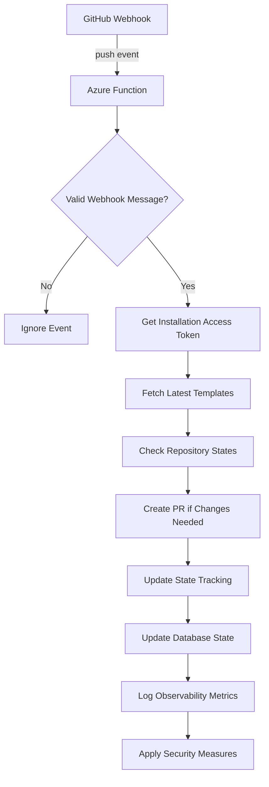

# Template Teleporter Specification

## Overview

The Template-Teleporter service automatically synchronize GitHub templates from master repository to
configured target repositories while respecting manual overrides.

## Glossary

* **Template Set**: A named collection of template file paths defined in the configuration, associated
  with specific repository types (e.g., `saas_rust`).
* **Master Checksum**: The SHA-256 checksum of the template file content in the `template-master` repository.
* **Deployed Checksum**: The SHA-256 checksum of the template file content last successfully
  deployed to a target repository by this tool.
* **Installation Token**: A short-lived GitHub API token generated by the GitHub App for accessing
  repositories it's installed on.

## Architecture



## Components

### 1. Configuration (template-teleporter.toml)

```toml
[repositories]
"org/api-service" = { template_set = "saas_rust" }
"org/core-library" = { template_set = "library_rust" }

[templates]
saas_rust = [
    ".github/ISSUE_TEMPLATE/bug_report.yml",
    ".github/PULL_REQUEST_TEMPLATE.md"
]
library_rust = [
    ".github/ISSUE_TEMPLATE/feature_request.yml",
    ".github/SECURITY.md"
]
```

### 2. GitHub Integration

* Authentication via GitHub App (JWT + Installation Tokens)
* Webhook payload verification
* Rate limit handling with exponential backoff
* Octocrab Rust crate for API interactions

### 3. State Management (DynamoDB)

```rust
#[derive(DynamoDbModel)]
struct TemplateState {
    repo: String,
    template_path: String,
    master_checksum: String,
    deployed_checksum: String,
    last_updated: DateTime<Utc>,
}
```

* `repo`: Full name of the target repository (e.g., "org/repo-name").
* `template_path`: Path to the template file within the repository (e.g., ".github/PULL_REQUEST_TEMPLATE.md").
* `master_checksum`: Checksum of the template in the master repository. Used to detect changes in the source.
* `deployed_checksum`: Checksum of the template last written to the target repo by this tool. Used to detect manual edits in the target.
* `last_updated`: Timestamp of the last successful synchronization for this template.

### 4. Change Detection

* Checksum comparison using SHA-256
* Manual change detection logic:

```rust
// If the content in the target repo differs from both the master template
// and the last version we deployed, it indicates a manual change.
if target_content != master_content && target_content != last_deployed_content {
    // handle_manual_change should log the detection and potentially notify administrators.
    // It prevents this tool from overwriting manual modifications.
    handle_manual_change(repo, path);
}
```

### 5. Observability

* CloudWatch Metrics:
  * TemplatesUpdated
  * ManualModificationsDetected
  * PrCreationFailures
* Structured JSON logging with request IDs

### Database Synchronization

To ensure the database remains up to date with the state of the master templates, the following steps will be implemented:

1. **Webhook Trigger**:
   * When a `push` event occurs in the `template-master` repository, the webhook triggers the synchronization process.

2. **Checksum Calculation**:
   * The system calculates the SHA-256 checksum of the updated template files in the master repository.

3. **Database Update**:
   * For each updated template, the corresponding `TemplateState` entry in the database is updated with the new `master_checksum` and `last_updated` timestamp.
   * If a template is removed from the master repository, its entry is deleted from the database.

4. **Error Handling**:
   * If the database update fails, the system logs the error and retries the operation with exponential backoff.

### Database Definition in Cloud Environments

#### AWS Environment

1. **DynamoDB Table**:
   * Table Name: `TemplateState`
   * Primary Key: `repo` (String)
   * Sort Key: `template_path` (String)
   * Additional Attributes:
     * `master_checksum` (String)
     * `deployed_checksum` (String)
     * `last_updated` (String, ISO 8601 format)

2. **Provisioning**:
   * Use Terraform to define the DynamoDB table.
   * Example Terraform configuration:

     ```hcl
     resource "aws_dynamodb_table" "template_state" {
       name           = "TemplateState"
       billing_mode   = "PAY_PER_REQUEST"
       hash_key       = "repo"
       range_key      = "template_path"

       attribute {
         name = "repo"
         type = "S"
       }

       attribute {
         name = "template_path"
         type = "S"
       }
     }
     ```

#### Azure Environment

1. **Azure Cosmos DB Table API**:
   * Database Name: `TemplateTeleporter`
   * Container Name: `TemplateState`
   * Partition Key: `/repo`
   * Additional Attributes:
     * `template_path` (String)
     * `master_checksum` (String)
     * `deployed_checksum` (String)
     * `last_updated` (String, ISO 8601 format)

2. **Provisioning**:
   * Use Terraform to define the Cosmos DB instance.
   * Example Terraform configuration:

     ```hcl
     resource "azurerm_cosmosdb_account" "template_teleporter" {
       name                = "templateTeleporterDb"
       location            = azurerm_resource_group.main.location
       resource_group_name = azurerm_resource_group.main.name
       offer_type          = "Standard"
       kind                = "GlobalDocumentDB"

       consistency_policy {
         consistency_level = "Session"
       }
     }

     resource "azurerm_cosmosdb_sql_database" "template_teleporter" {
       name                = "TemplateTeleporter"
       resource_group_name = azurerm_resource_group.main.name
       account_name        = azurerm_cosmosdb_account.template_teleporter.name
     }

     resource "azurerm_cosmosdb_sql_container" "template_state" {
       name                = "TemplateState"
       resource_group_name = azurerm_resource_group.main.name
       account_name        = azurerm_cosmosdb_account.template_teleporter.name
       database_name       = azurerm_cosmosdb_sql_database.template_teleporter.name
       partition_key_path  = "/repo"

       unique_key {
         paths = ["/template_path"]
       }
     }
     ```

### Infrastructure as Code (IaC)

All infrastructure provisioning and management will be handled using **Terraform**. This includes:

1. **Database Setup**:
   * Define DynamoDB tables for AWS or Cosmos DB for Azure using Terraform modules.

2. **Cloud Resources**:
   * Provision AWS Lambda functions, API Gateway, and other required resources.
   * For Azure, provision Azure Functions, Cosmos DB, and other necessary services.

3. **Version Control**:
   * All Terraform configurations will be stored in the repository under a dedicated `infrastructure/` directory.

4. **State Management**:
   * Use a remote backend (e.g., AWS S3 with DynamoDB for state locking or Azure Blob Storage) to manage Terraform state files securely.

5. **CI/CD Integration**:
   * Integrate Terraform workflows into the CI/CD pipeline to automate infrastructure deployment and updates.

### Evaluation of DynamoDB

DynamoDB is a suitable choice for this application due to its:

* **Scalability**: Handles high throughput with low latency.
* **Integration**: Seamlessly integrates with AWS Lambda and other AWS services.
* **Cost-Effectiveness**: Pay-per-request billing model reduces costs for low-usage scenarios.

However, if Azure is the preferred cloud provider, Azure Cosmos DB (Table API) offers similar capabilities and better integration with Azure services. The choice between DynamoDB and Cosmos DB should depend on the cloud environment where the application will primarily run.

### Security Considerations

To ensure the Template Teleporter application is secure, the following measures will be implemented:

#### 1. Authentication and Authorization

* **GitHub Integration**:
  * Use GitHub App authentication with JWTs and short-lived installation tokens.
  * Validate webhook payloads using the GitHub App's secret to ensure authenticity.

* **Cloud Resources**:
  * Use IAM roles and policies in AWS or Managed Identities in Azure to restrict access to only necessary resources.

#### 2. Data Security

* **Database**:
  * Encrypt data at rest using AWS DynamoDB's built-in encryption or Azure Cosmos DB's encryption features.
  * Use secure connections (e.g., TLS) for all database interactions.

* **Environment Variables**:
  * Store sensitive information (e.g., GitHub App private key, database credentials) in secure storage solutions like AWS Secrets Manager or Azure Key Vault.

#### 3. Communication Security

* **API Calls**:
  * Use HTTPS for all API interactions to ensure data in transit is encrypted.
  * Implement rate limiting and exponential backoff to handle API rate limits securely.

#### 4. Cloud Resource Security

* **Infrastructure as Code (IaC)**:
  * Use Terraform to define security groups, network ACLs, and other access controls.
  * Regularly review and update Terraform configurations to follow the principle of least privilege.

* **Monitoring and Logging**:
  * Enable logging for all cloud resources (e.g., AWS CloudWatch, Azure Monitor).
  * Use structured logging with request IDs for traceability.

#### 5. Application Security

* **Input Validation**:
  * Validate all inputs to prevent injection attacks.

* **Error Handling**:
  * Avoid exposing sensitive information in error messages.

#### 6. Security Best Practices

* **Regular Audits**:
  * Conduct regular security audits and vulnerability scans.

* **Dependency Management**:
  * Use tools like `cargo audit` to check for vulnerabilities in Rust dependencies.
* **Secrets Rotation**:
  * Regularly rotate secrets and access tokens to minimize exposure risk.

#### 7. Advanced Security Measures

* **API Abuse Prevention**:
  * Implement anomaly detection to identify unusual patterns of API usage.
  * Use rate limiting to prevent excessive API calls from a single source.
  * Monitor API usage logs for suspicious activity and take automated actions if necessary.

* **Cloud Resource Configurations**:
  * Define explicit IAM roles and policies for each cloud resource to ensure the principle of least privilege is followed.
  * Regularly audit cloud configurations to identify and fix misconfigurations.
  * Use tools like AWS Config or Azure Policy to enforce compliance with security best practices.

## Dependencies

```toml
[dependencies]
# GitHub API Interaction
octocrab = "0.18"

# AWS SDK
aws-sdk-dynamodb = "0.56" # For state management
# Potentially add aws-config, aws-sdk-secretsmanager later if needed

# Serialization & Hashing
serde = { version = "1.0", features = ["derive"] }
serde_json = "1.0" # For webhook payloads
serde_dynamo = "4.2" # For DynamoDB interaction
sha2 = "0.10" # For checksum calculation

# Async Runtime & Utilities
tokio = { version = "1", features = ["full"] } # Assuming Tokio runtime for Lambda
async-trait = "0.1" # For defining async traits if needed
tracing = "0.1" # For logging/observability
tracing-subscriber = { version = "0.3", features = ["json"] } # For structured logging
```

*Note: Specific versions might need adjustment based on compatibility and latest releases.*

## Suggested Crates for Template Teleporter

To modularize the Template Teleporter application and ensure maintainability, the following crates
are suggested:

1. **core**
   * **Purpose**: Core logic, data structures, state management and database interactions for the
     Template Teleporter application.
   * **Responsibilities**:
     * Define shared data models (e.g., `TemplateState`).
     * Implement checksum calculation logic.
     * Provide utilities for configuration parsing.
     * Interact with the database for storing and retrieving `TemplateState`.
     * Implement retry logic for database operations.
   * **Dependencies**:
     * `serde`, `serde_json` for serialization.
     * `sha2` for checksum calculation.
     * `serde_dynamo` for DynamoDB serialization.

2. **developer_platforms**
   * **Purpose**: Integration with various developer platforms.
   * **Responsibilities**:
     * Handle authentication using GitHub App tokens.
     * Interact with GitHub APIs for fetching templates, creating PRs, etc.
     * Validate webhook payloads.
   * **Dependencies**:
     * `octocrab` for GitHub API interactions.
     * `jsonwebtoken` for JWT generation.

3. **cli**
   * **Purpose**: Command-line interface for manual operations and debugging.
   * **Responsibilities**:
     * Provide commands for testing configurations, triggering syncs, etc.
   * **Dependencies**:
     * `clap` for CLI argument parsing.
     * `template_teleporter_core`, `template_teleporter_github` for shared functionality.

4. **azure_functions**
   * **Purpose**: Azure Functions implementation for the Template Teleporter application.
   * **Responsibilities**:
     * Serve as the entry point for the application in Azure.
     * Handle webhook events and trigger synchronization logic.
     * Provide implementation for Azure-specific features (e.g., Cosmos DB integration).
   * **Dependencies**:
     * `azure_functions` for Azure Functions runtime.
     * `template_teleporter_core`, `template_teleporter_github` for core functionality.

5. **aws_lambda**
   * **Purpose**: AWS Lambda function implementation.
   * **Responsibilities**:
     * Serve as the entry point for the application.
     * Handle webhook events and trigger synchronization logic.
     * Provide implementation for AWS-specific features (e.g., DynamoDB integration).
   * **Dependencies**:
     * `lambda_runtime` for AWS Lambda runtime.
     * `template_teleporter_core`, `template_teleporter_github` for core functionality.

These crates will be organized in a cargo workspace, allowing for shared dependencies and easy
management of the overall project.

## Deployment

1. AWS Lambda deployment with Rust runtime
2. Environment variables:
   * GITHUB_APP_ID
   * GITHUB_APP_PRIVATE_KEY (base64 encoded PEM)
   * AWS_REGION
3. CloudFormation template for infrastructure setup

## Workflow

1. **Webhook Trigger**: The AWS Lambda function is triggered by a GitHub webhook upon a `push` event to the default branch of the `template-master` repository.
2. **Event Validation**: The function verifies the webhook signature using the GitHub App's secret to ensure authenticity. It parses the payload to identify changed template files.
3. **Authentication**: For each target repository defined in the configuration, the function generates a short-lived installation access token using the GitHub App's credentials.
4. **State Comparison**: The function fetches the current `TemplateState` for each relevant template from DynamoDB. It compares the `master_checksum` from the state table with the checksum of the newly pushed template content from the `template-master` repo. It also fetches the current template content from the target repository via the GitHub API.
5. **Update Logic & PR Creation**:
    * If the master template has changed (`new_master_checksum != state.master_checksum`):
        * Check for manual changes in the target repository (`target_content != master_content && target_content != state.deployed_checksum`).
        * If no manual changes are detected, create/update a branch in the target repository with the new template content and open a Pull Request using the GitHub API.
        * If manual changes *are* detected, log this event and skip the update for this template (see Manual Change Detection).
6. **State Update**: If a PR is successfully created (or if the template was already up-to-date), update the corresponding `TemplateState` item in DynamoDB with the new `master_checksum`, `deployed_checksum` (matching the new master), and `last_updated` timestamp.

## Open Questions

1. Retention policy for old template versions?
2. Notification strategy for manual overrides?
